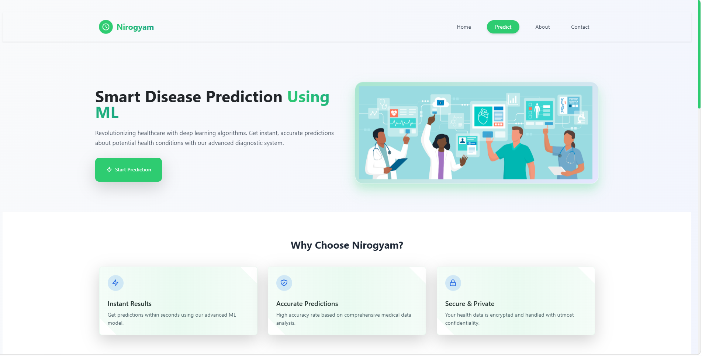
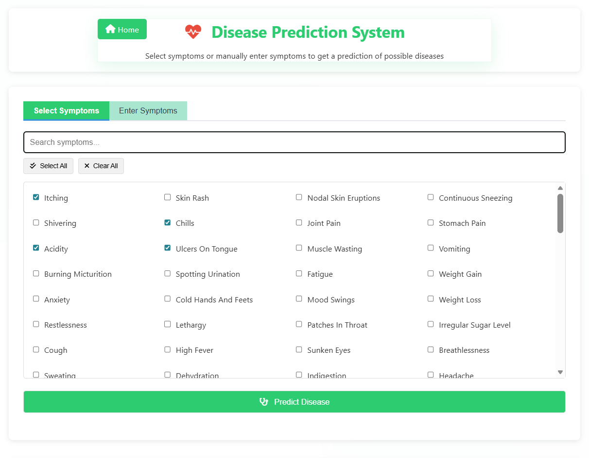
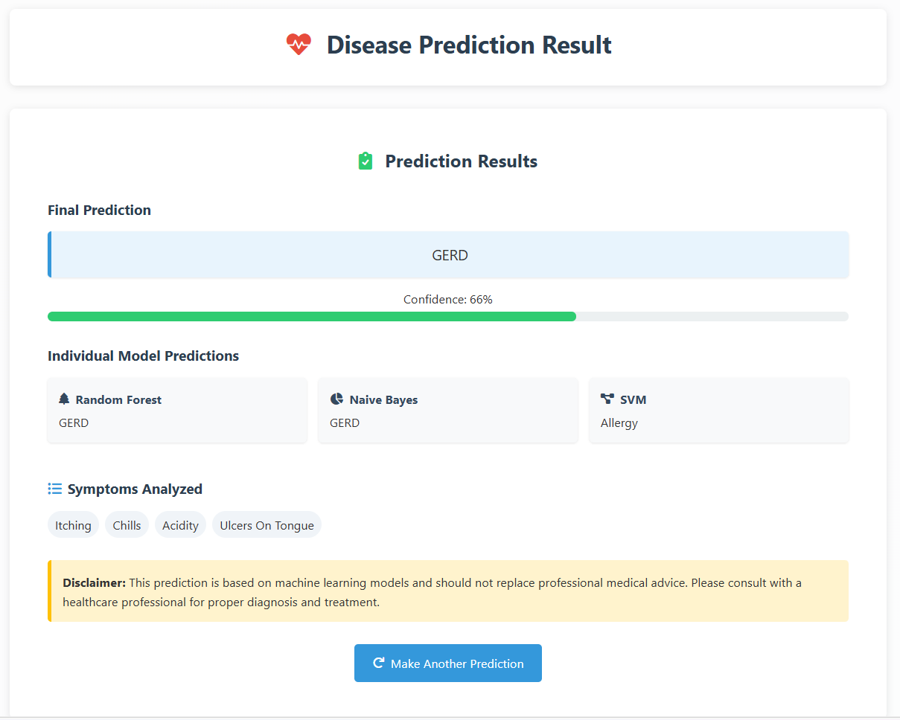

# 🏥 Nirogyam: AI-Powered Disease Prediction System

An intelligent healthcare web application that predicts diseases based on symptoms using Machine Learning ensemble models. The system combines Random Forest, Naive Bayes, and Support Vector Machine (SVM) algorithms to improve prediction reliability through majority voting.

---

## 🚀 Features

* Symptom-based disease prediction
* Ensemble Machine Learning approach
* Random Forest, Naive Bayes, and SVM models
* Majority voting for improved prediction reliability
* Interactive Flask web application
* Responsive and user-friendly interface
* Real-time disease prediction

---

## 🛠️ Technology Stack

### Frontend

* HTML5
* CSS3
* JavaScript

### Backend

* Flask
* Python

### Machine Learning

* Scikit-Learn
* Random Forest
* Naive Bayes
* Support Vector Machine (SVM)

### Data Processing

* Pandas
* NumPy

---

## 📸 Application Preview

### Application Homepage

### Symptom Selection Workflow

### Prediction Output Dashboard

---

## 📂 Project Structure

Nirogyam-Disease-Prediction-System

├── app.py

├── requirements.txt

├── README.md

├── templates/

├── static/

├── screenshots/

├── Training.csv

├── Testing.csv

├── new_disease_prediction_system.pkl

└── Notebook-Disease_Prediction_Using_Machine_Learning.ipynb

---

## ⚙️ Installation & Setup

Clone the repository

git clone https://github.com/Sourav-Grover/Nirogyam-Disease-Prediction-System.git

cd Nirogyam-Disease-Prediction-System

Install dependencies

pip install -r requirements.txt

Run the application

python app.py

Open your browser:

http://127.0.0.1:5000

---

## 🧠 Machine Learning Workflow

1. User selects symptoms.
2. Symptoms are converted into feature vectors.
3. Random Forest predicts disease.
4. Naive Bayes predicts disease.
5. SVM predicts disease.
6. Majority voting determines the final prediction.
7. Results are displayed to the user.

---

## 📈 Future Enhancements

* Doctor recommendation system
* Medicine suggestion module
* Disease severity estimation
* Cloud deployment
* AI-powered healthcare assistant

---

## ⚠️ Disclaimer

This project is developed for educational and research purposes only and should not replace professional medical advice.

---

## 👨‍💻 Author

Sourav Grover

B.Tech Computer Science Engineering

KIIT University
